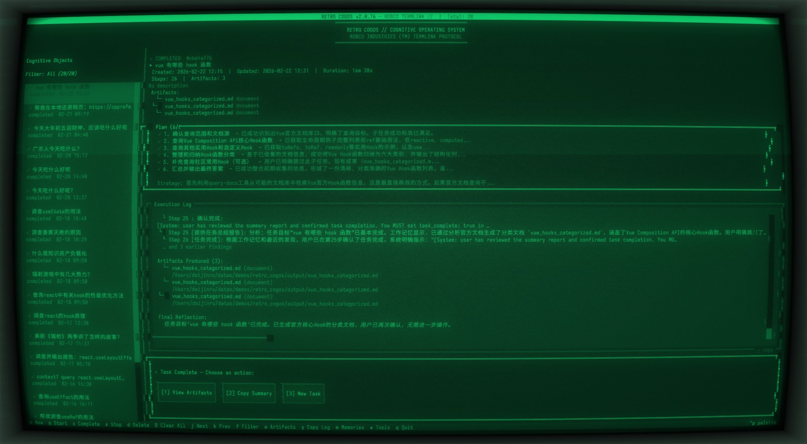
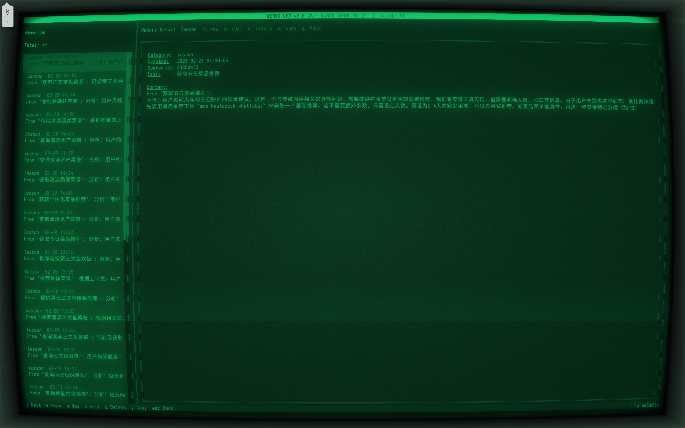

**[English](./README.md)** | 中文

# Overseer — 没有人类许可，AI 寸步难行

> 战争从未改变。对人类监督的需求也一样。

在 Fallout 的世界里，**Overseer（监督者）** 是每个 Vault 的最高管理者。核战争将地表化为焦土，Vault-Tec 建造了地下避难所来保护人类文明的延续——而 Overseer 就是那个掌控避难所命运的人。每一扇门的开关、每一份资源的分配、每一个居民能否离开 Vault，都由 Overseer 决定。没有 Overseer 的批准，Vault 里什么都不会发生。

在 AI 的世界里，情况惊人地相似。LLM 能读写文件、调用 API、执行代码、操作外部系统——能力扩张的速度远超人类建立信任的速度。地表已经不安全了，我们需要一个 Overseer。

**Overseer** 是一道 AI 动作防火墙。它坐在 LLM 的决策输出和真实世界的执行之间，负责**拦截、分级、审计和自适应**——确保每一个 AI 动作的风险暴露都在人类可接受的范围内。就像 Vault 的 Overseer 不亲自搬运物资但控制着一切的发生，这个 Overseer 不执行任何具体任务，但没有它的许可，AI 的任何动作都无法触达真实世界。

基于 [Textual](https://textual.textualize.io/) 的终端 TUI 界面（Fallout Pip-Boy 主题），通过 [MCP](https://modelcontextprotocol.io/) 协议扩展工具能力。






## 架构设计

Overseer 分为**不可替换的内核**和**可插拔的插件**两部分。

划分标准：**如果移除这个组件，系统是否还是一道防火墙？** 是 → 插件。不是 → 内核。

### 内核 — 定义系统身份

**FirewallEngine** — 防火墙唯一的决策中心。所有安全判断在这里做出：
- **PolicyStore**：双层权限策略（AdminPolicy 不可变 + UserPolicy 可自适应），四级权限规则
- **五层检查管线**：参数过滤 → 循环检测 → 权限判定 → 路径沙箱 → 元认知熔断
- **自适应升级**：读取 PerceptionBus 统计数据，决定是否升级工具权限（仅作用于 UserPolicy 层，AdminPolicy 不可变）
- **决策解析**：从 LLM 原始输出中提取 `LLMDecision`，解析失败时 fail-safe 默认为 `human_required=True`
- **PromptPolicy**：安全相关的系统提示词由内核管理并注入

**HumanGate** — 人机通道。当 FirewallEngine 判定需要人类决策时，这是唯一的通道：
- `asyncio.Event` 请求/等待/接收机制，超时处理
- 意图解析：批准/拒绝/中止/自由文本检测
- 多阶段中止：首次温和停止 → 第二次强制中止

**PerceptionBus** — 纯粹的信号记录器。只收集、只统计、**不做判断**：
- 记录：审批结果、confidence 值、停滞信号
- 统计：批准/拒绝比率、连续拒绝计数、犹豫频次
- 分类：工具结果语义分类、连续调用 diff 检测

### 插件 — 可替换的能力

插件通过 `Protocol` 接口接入内核。内核不依赖任何插件的具体实现。

| 插件 | 职责 | 可替换场景 |
|------|------|-----------|
| `LLMPlugin` | 纯推理，不做安全判断 | 换模型、换 provider、本地推理 |
| `ToolPlugin` | 工具发现与执行，不做权限判断 | 换 MCP 实现、换工具集 |
| `PlanPlugin` | 任务分解，简单任务可跳过 | 换规划策略 |
| `MemoryPlugin` | 长期记忆存储与检索 | 换存储后端 |
| `ContextPlugin` | 上下文组装与压缩 | 换 prompt 模板 |

## 核心特性

### 五层安全防护 — 不信任 LLM

| 层级 | 机制 | 效果 |
|------|------|------|
| 参数层 | 对比 Schema 自动过滤幻觉参数，并反馈给 LLM 形成自纠正循环 | 工具调用不会因为 LLM 编造参数而失败 |
| 行为层 | 双重循环检测（精确重复 + 同名重复），阈值根据 confidence 动态调整 | 死循环被自动打断 |
| 权限层 | 4 级权限（auto / notify / confirm / approve）+ 运行时自适应升级 | 高风险操作必须人工审批 |
| 输出层 | 统一路径沙箱，builtin 和 MCP 工具的文件写入都限制在 `output/` 目录 | LLM 无法写到不该写的地方 |
| 元认知层 | confidence 连续走低自动触发 HITL，反思检测"无进展"注入策略切换提示 | 系统在 LLM"迷路"时主动求助 |

### 自适应规则引擎

- **审批行为追踪**：每个工具的批准/拒绝计数、连续拒绝次数
- **自动权限升级**：连续拒绝 3 次 → 工具权限提升至 APPROVE + 上下文注入回避信号。升级仅作用于 UserPolicy 层（AdminPolicy 不可变）
- **犹豫检测**：审批耗时超过阈值 → 注入"用户可能不确定"信号
- **偏好持久化**：高拒绝率/高批准率工具的使用偏好写入长期记忆，跨会话生效

### 感知系统 — 系统能"感受到"发生了什么

**自身状态感知** — confidence 滑动窗口监测，反思结果中的停滞信号检测，prompt 中注入步数和耗时。

**工具结果语义感知** — 工具结果自动分类（success / error / empty / partial），同一工具前后调用结果 diff 检测，意图与实际结果的偏离告警。

**用户行为隐式感知** — 审批响应时间计时（犹豫会被注意到），approve/reject 比率统计，连续拒绝触发权限自动升级，稳定偏好写入跨事件 Memory。

### 双向人机交互

- **LLM 主动发起**：模型可以设置 `human_required: true` 并提供选项列表
- **用户三种输入方式**：按钮点击、数字键快捷键、自由文本输入
- **隐式意图理解**：用户文本中的"停"、"算了"、"enough"等隐式停止线索会被识别
- **asyncio.Event 同步**：循环暂停等待人工输入，无轮询

### MCP 工具生态

通过 MCP 协议连接外部工具服务器，支持 stdio、SSE、streamable HTTP 三种传输方式：

```yaml
mcp:
  servers:
    howtocook:
      transport: stdio
      command: npx
      args: ["-y", "howtocook-mcp"]
```

## 快速开始

### 安装

```bash
git clone <repo-url> && cd overseer
uv sync
```

### 初始化

```bash
# 初始化配置文件到 ~/.overseer/
uv run overseer init

# 编辑配置，填入 LLM API 密钥
vim ~/.overseer/config.yaml
```

### 启动

```bash
# 启动 TUI（以下两种写法等效）
uv run overseer
uv run overseer run

# 其他命令
uv run overseer version       # 查看版本
uv run overseer init --force  # 重置配置为默认值
```

### 打包二进制（可选）

```bash
./release.sh
# 二进制文件位于 dist/overseer
```

### 推荐终端与字体

Overseer 使用 Fallout Pip-Boy CRT 终端主题，推荐搭配 [cool-retro-term](https://github.com/Swordfish90/cool-retro-term) 获得最佳视觉体验——自带 CRT 扫描线、荧光扩散、屏幕弯曲等效果。

```bash
# macOS
brew install --cask cool-retro-term
```

中文字体推荐 [更纱黑体 (Sarasa Gothic)](https://github.com/be5invis/Sarasa-Gothic)：

```bash
# macOS
brew install --cask font-sarasa-gothic
```

### 快捷键

| 按键 | 操作 |
|------|------|
| `n`  | 新建认知对象 |
| `s`  | 启动选中的认知对象 |
| `c`  | 手动标记为已完成 |
| `x`  | 暂停运行中的认知对象 |
| `d`  | 删除选中的认知对象 |
| `D`  | 清空所有认知对象 |
| `j/k` | 上下移动选择 |
| `f`  | 切换状态过滤 |
| `a`  | 查看当前 CO 的产出物 |
| `m`  | 打开记忆浏览器 |
| `w`  | 打开工具面板 |
| `q`  | 退出 |

## 配置

运行 `overseer init` 将内置模板生成到 `~/.overseer/config.yaml`。配置文件查找顺序（第一个匹配的生效）：

1. `./config.yaml`（当前工作目录）
2. `./config.yml`（当前工作目录）
3. `~/.overseer/config.yaml`（用户主目录）
4. `~/.overseer/config.yml`（用户主目录）
5. Pydantic 默认值（未找到任何配置文件时）

所有数据路径未配置时默认写入 `~/.overseer/`：

| 路径 | 默认值 |
|------|--------|
| 数据库 | `~/.overseer/overseer_data.db` |
| 产出物 | `~/.overseer/output/` |
| 日志 | `~/.overseer/logs/` |

```yaml
llm:
  base_url: "https://api.openai.com/v1"
  model: "gpt-4o"
  api_key: "your-key"
  max_tokens: 4096
  temperature: 0.7

database:
  path: "overseer_data.db"

mcp:
  servers: {}

tool_permissions:
  file_read: auto        # 自动执行
  file_write: confirm    # 需确认
  file_delete: approve   # 需预览+审批
  default: confirm
```

### 工具权限级别

| 级别 | 行为 | 运行时行为 |
|------|------|-----------|
| `auto` | 自动执行，不需人工介入 | — |
| `notify` | 执行后通知用户 | — |
| `confirm` | 执行前需要用户确认 | 用户连续拒绝 3 次 → 自动升级为 approve |
| `approve` | 显示预览面板，用户审批后执行 | — |

## 关键文件

```
overseer/
├── __main__.py                 # 入口
├── cli.py                      # CLI 命令（init / run / version）
├── config.py                   # YAML 配置 + Pydantic 校验
├── database.py                 # SQLAlchemy 引擎 + Session 工厂
├── core/
│   ├── enums.py                # COStatus, ExecutionStatus, ToolPermission
│   ├── protocols.py            # LLMDecision, ToolCall, NextAction
│   └── plugin_protocols.py     # Plugin Protocol 接口
├── kernel/
│   ├── firewall_engine.py      # FirewallEngine, PolicyStore, Sandbox, PromptPolicy
│   ├── human_gate.py           # HumanGate, Intent, ApprovalResult
│   ├── perception_bus.py       # PerceptionBus, PerceptionStats
│   └── registry.py             # PluginRegistry
├── models/
│   ├── cognitive_object.py     # CognitiveObject ORM
│   ├── execution.py            # Execution ORM
│   ├── memory.py               # Memory ORM
│   └── artifact.py             # Artifact ORM
├── services/
│   ├── execution_service.py    # 编排层（精简，不含安全逻辑）
│   ├── llm_service.py          # LLMPlugin 实现
│   ├── tool_service.py         # ToolPlugin 实现
│   ├── context_service.py      # ContextPlugin 实现
│   ├── memory_service.py       # MemoryPlugin 实现
│   ├── planning_service.py     # PlanPlugin 实现
│   ├── artifact_service.py     # 产出物管理
│   └── cognitive_object_service.py  # CO CRUD
└── tui/
    ├── app.py                  # OverseerApp 主应用
    ├── theme.py                # Fallout Pip-Boy 终端主题
    ├── screens/                # TUI 屏幕
    └── widgets/                # TUI 组件
```

## 开发

```bash
# 安装开发依赖
uv sync

# 运行测试
uv run pytest tests/ -v

# 启动应用（开发模式）
uv run overseer

# 或通过模块启动
uv run python -m overseer
```

## 技术栈

- Python 3.11+
- [Textual](https://textual.textualize.io/) — 终端 TUI 框架
- [SQLAlchemy 2.0](https://www.sqlalchemy.org/) — ORM
- [SQLite](https://www.sqlite.org/) (WAL mode) — 持久化
- [Pydantic 2.0](https://docs.pydantic.dev/) — 配置校验 + 数据协议
- [Click](https://click.palletsprojects.com/) — CLI 框架
- [httpx](https://www.python-httpx.org/) — 异步 HTTP 客户端（LLM API）
- [MCP](https://modelcontextprotocol.io/) — Model Context Protocol 工具扩展
