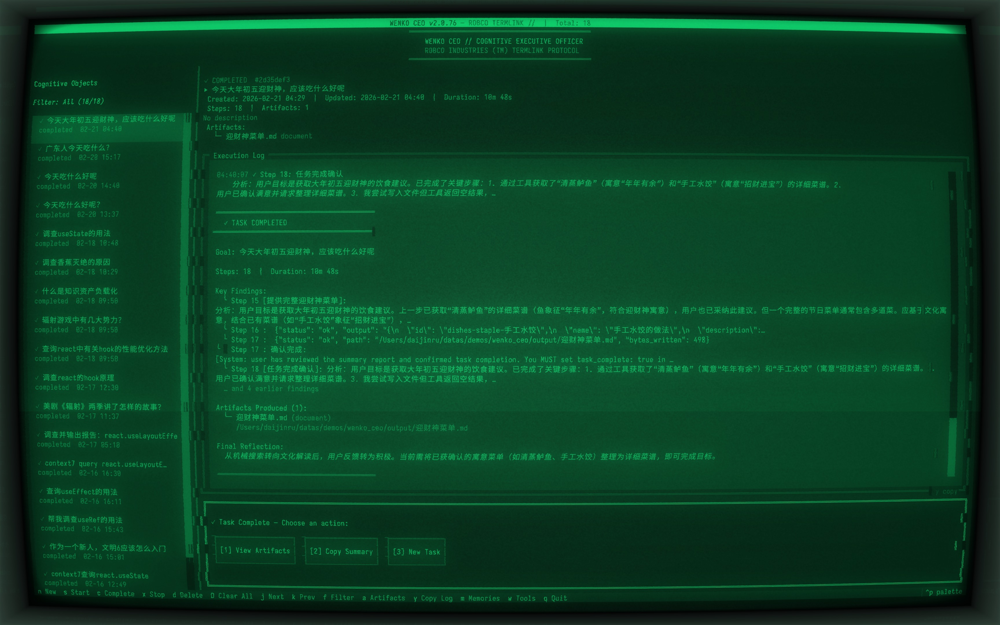

**[English](./README.md)** | 中文

# Wenko CEO — Cognitive Operating System

> 不是聊天机器人加了工具，而是把 LLM 当 CPU 的操作系统。

Wenko CEO 将用户目标抽象为 **CognitiveObject（认知进程）**，通过自主认知循环驱动 LLM 进行多步推理、工具调用和人机交互，最终完成复杂任务。多个认知进程可并发运行，系统通过多层感知和安全机制确保执行可控、可信赖。

基于 [Textual](https://textual.textualize.io/) 的终端 TUI 界面，通过 [MCP](https://modelcontextprotocol.io/) 协议扩展工具能力。




## 核心特性

### 认知进程，不是对话

Wenko CEO 的核心隐喻是**操作系统**，而非对话界面：

- 用户创建的不是"对话"，而是有完整生命周期的认知进程（created → running → paused → completed）
- 多个进程可并发运行，各自拥有独立的上下文、执行历史和数据库 Session
- 上下文不是线性聊天记录，而是**累积状态（StateDict）**——结构化的知识库，支持压缩和窗口滑动

### 五层安全防护 — 不信任 LLM

系统假设 LLM 是强大但不可靠的推理引擎，围绕这个前提建立了纵深防御：

| 层级 | 机制 | 效果 |
|------|------|------|
| 参数层 | 对比 Schema 自动过滤幻觉参数，并反馈给 LLM 形成自纠正循环 | 工具调用不会因为 LLM 编造参数而失败 |
| 行为层 | 双重循环检测（精确重复 + 同名重复），阈值根据 confidence 动态调整 | 死循环被自动打断 |
| 权限层 | 4 级权限（auto / notify / confirm / approve）+ 运行时自适应升级 | 高风险操作必须人工审批 |
| 输出层 | 统一路径沙箱，builtin 和 MCP 工具的文件写入都限制在 `output/` 目录 | LLM 无法写到不该写的地方 |
| 元认知层 | confidence 连续走低自动触发 HITL，反思检测"无进展"注入策略切换提示 | 系统在 LLM"迷路"时主动求助 |

### 感知系统 — 系统能"感受到"发生了什么

不只是执行工具和记录结果，系统具备三层感知能力：

**自身状态感知（Phase 1）** — confidence 滑动窗口监测，反思结果中的停滞信号检测，prompt 中注入步数和耗时，让 LLM 知道自己"花了多少资源"。

**工具结果语义感知（Phase 2）** — 工具结果自动分类（success / error / empty / partial），同一工具前后调用结果 diff 检测，意图与实际结果的偏离告警。

**用户行为隐式感知（Phase 3）** — 审批响应时间计时（犹豫会被注意到），approve/reject 比率统计，连续拒绝触发权限自动升级，稳定偏好写入跨事件 Memory。

### 会学习，不是每次从零开始

- **跨事件记忆**：从 LLM 回复中提取经验、偏好和知识，存入 Memory 表
- **隐式偏好持久化**：用户的工具审批模式被统计并写入记忆，新任务自动加载
- **关键词 + 评分检索**：新 CO 启动时，根据目标描述从所有历史记忆中检索相关内容注入 prompt

### 双向人机交互

不是"系统问、人答"的单向模式：

- **LLM 主动发起**：模型可以设置 `human_required: true` 并提供选项列表
- **用户三种输入方式**：按钮点击、数字键快捷键、自由文本输入
- **隐式意图理解**：用户文本中的"停"、"算了"、"enough"等隐式停止线索会被识别并引导 LLM 自行收尾
- **asyncio.Event 同步**：循环暂停等待人工输入，无轮询

### MCP 工具生态

通过 MCP 协议连接外部工具服务器，支持 stdio、SSE、streamable HTTP 三种传输方式：

```yaml
mcp:
  servers:
    howtocook:
      transport: stdio
      command: npx
      args: ["-y", "howtocook-mcp"]
```

- MCP 子进程 stderr 通过自定义 `_StderrPipe`（os.pipe + 后台线程）实时捕获并转发到 TUI
- monkey-patch `mcp.stdio_client` 解决 stderr 绑定在 import time 的限制
- 工具执行自动重试 + 指数退避（最多 3 次）
- ToolPanelScreen 提供完整的工具浏览器（分组、Schema 展示、按需连接、剪贴板复制）

### 任务闭环 — 不只是"做完"

```
创建 CO → 认知循环运行 → Artifact 自动归档 → 完成摘要 → 后续操作
```

- Artifact 自动检测：任何工具写出的文件都被记录（通过 `_PATH_KEYS` 模式匹配）
- 完成后展示摘要 + 操作面板（查看产物 / 复制摘要 / 启动新任务）
- Artifact 预览器支持文本文件 TUI 内预览、二进制文件系统应用打开

### 结构化日志 — 可审计

- **应用日志**：`TimedRotatingFileHandler`，每日轮转，保留 14 天
- **工具结果日志**：独立 JSON Lines 文件（`tool_results.jsonl`），每条记录含 timestamp、co_id、step、tool、status、output、error
- **完整执行审计链**：每步的 prompt、LLM 原始回复、解析决策、工具调用和结果、人工输入全部持久化到 Execution 表

## 快速开始

```bash
# 克隆项目
git clone <repo-url> && cd wenko_ceo

# 复制配置文件并填入你的 LLM API 密钥
cp config.cp.yaml config.yaml
# 编辑 config.yaml，配置 llm.api_key、llm.base_url 等

# 启动（需要 uv）
./start.sh
```

### 推荐终端与字体

Wenko CEO 使用 Fallout Pip-Boy CRT 终端主题，推荐搭配 [cool-retro-term](https://github.com/Swordfish90/cool-retro-term) 获得最佳视觉体验——自带 CRT 扫描线、荧光扩散、屏幕弯曲等效果。

```bash
# macOS
brew install --cask cool-retro-term
```

cool-retro-term 内置的复古字体不包含中文字形，推荐安装 [更纱黑体 (Sarasa Gothic)](https://github.com/be5invis/Sarasa-Gothic)，专为终端设计的等宽字体，中英文对齐良好：

```bash
# macOS
brew install --cask font-sarasa-gothic
```

安装后打开 cool-retro-term → Settings → General → Font → 取消勾选 **Use builtin fonts**，然后选择 **Sarasa Mono SC** 作为字体。

### 快捷键

| 按键 | 操作 |
|------|------|
| `n`  | 新建认知对象 |
| `s`  | 启动选中的认知对象 |
| `c`  | 手动标记为已完成 |
| `x`  | 暂停运行中的认知对象 |
| `d`  | 删除选中的认知对象 |
| `D`  | 清空所有认知对象 |
| `j/k` | 上下移动选择 |
| `f`  | 切换状态过滤 |
| `a`  | 查看当前 CO 的产出物 |
| `m`  | 打开记忆浏览器 |
| `w`  | 打开工具面板 |
| `q`  | 退出 |

## 架构设计

```
┌─────────────────────────────────────────────────┐
│                    TUI 层                        │
│  CeoApp ← HomeScreen ← [COList, CODetail,      │
│            ExecutionLog, InteractionPanel,        │
│            ToolPreview]                           │
│  ToolPanelScreen  ArtifactViewer  MemoryScreen   │
│  ConfirmScreen    CreateScreen                    │
├─────────────────────────────────────────────────┤
│                   服务层                          │
│  ExecutionService  ← 认知循环编排 + 感知系统       │
│  ├── LLMService        LLM API 调用 + 决策解析   │
│  ├── ToolService       工具管理 + MCP + 权限控制  │
│  ├── ContextService    上下文构建 + 压缩 + 语义分析│
│  ├── MemoryService     跨事件记忆 + 偏好持久化     │
│  ├── ArtifactService   产出物管理                  │
│  └── COService         CO CRUD                    │
├─────────────────────────────────────────────────┤
│                   数据层                          │
│  SQLAlchemy ORM + SQLite (WAL mode)              │
│  [CognitiveObject, Execution, Memory, Artifact]  │
├─────────────────────────────────────────────────┤
│                   日志层                          │
│  logging_config: 应用日志 + 工具结果 JSONL        │
└─────────────────────────────────────────────────┘
```

### 层次职责

**TUI 层** — Textual 应用，Fallout Pip-Boy 终端主题。通过 Textual Worker 运行认知循环，`post_message()` 实现 worker → app 的异步通信。6 种自定义 Message 类型构成类型化事件总线。

**服务层** — 业务逻辑核心。`ExecutionService` 是编排器（Mediator 模式），驱动认知循环并集成三层感知系统。通过回调函数与 TUI 层完全解耦。每个实例拥有独立的 SQLAlchemy Session，支持多 CO 并发。

**数据层** — SQLite + WAL 模式支持并发读。外键约束 + 级联删除保证数据一致性。

**日志层** — 双通道：应用日志（每日轮转）+ 工具结果 JSON Lines（大小轮转），`propagate=False` 保证互不干扰。

### 认知循环详解

每一步循环（`ExecutionService.run_loop`）执行以下流程：

```
1. 创建 Execution 记录
2. 构建 prompt（目标 + 资源状态 + 工具列表 + 累积发现 + 记忆 + 反思）
3. 调用 LLM
4. 解析结构化决策（三级回退：正则 → JSON 提取 → 默认请求人工）
4.5. 元感知：confidence 监测 → 连续低信心触发 HITL
5. 工具执行（参数过滤 → 循环检测 → 权限审批 → 执行 → 结果分类 → diff 检测 → 偏离告警）
6. 人机交互（用户行为计时 → 偏好统计 → 隐式意图检测）
7. 上下文合并
8. 自我反思（每 N 步）→ 停滞检测 → 策略切换注入
9. 记忆提取
9.5. 隐式偏好注入
10. 上下文压缩
11. 完成检测（偏好持久化 → 断开 MCP → 回调通知）
```

### 关键文件

```
ceo/
├── __main__.py                 # 入口
├── config.py                   # YAML 配置 + Pydantic 校验
├── database.py                 # SQLAlchemy 引擎 + Session 工厂
├── logging_config.py           # 双通道日志配置
├── core/
│   ├── enums.py                # COStatus, ExecutionStatus, ToolPermission
│   └── protocols.py            # LLMDecision, ToolCall, NextAction
├── models/
│   ├── cognitive_object.py     # CognitiveObject ORM
│   ├── execution.py            # Execution ORM
│   ├── memory.py               # Memory ORM
│   └── artifact.py             # Artifact ORM
├── services/
│   ├── execution_service.py    # 认知循环编排 + 感知系统
│   ├── llm_service.py          # LLM API + 决策解析
│   ├── tool_service.py         # 工具管理 + MCP + 路径沙箱 + 权限覆盖
│   ├── context_service.py      # 上下文构建 / 压缩 / 工具结果分类 / diff / 偏离检测
│   ├── memory_service.py       # 跨事件记忆 + 偏好提取
│   ├── artifact_service.py     # 产出物管理
│   └── cognitive_object_service.py  # CO CRUD
└── tui/
    ├── app.py                  # CeoApp 主应用 + 消息总线
    ├── theme.py                # Fallout Pip-Boy 终端主题
    ├── styles/app.tcss         # TUI 样式
    ├── screens/
    │   ├── home.py             # 主屏幕
    │   ├── create.py           # 创建 CO 对话框
    │   ├── confirm.py          # 确认操作对话框
    │   ├── memory.py           # 记忆浏览器
    │   ├── memory_edit.py      # 记忆编辑
    │   ├── tool_panel.py       # 工具面板（分组浏览 + 按需连接）
    │   ├── tool_result.py      # 工具结果查看
    │   └── artifact_viewer.py  # 产出物预览 / 打开
    └── widgets/
        ├── co_list.py          # CO 列表（状态过滤 + 等待标记）
        ├── co_detail.py        # CO 详情
        ├── execution_log.py    # 执行日志 + 完成摘要
        ├── interaction_panel.py # 人机交互面板（三种输入方式）
        └── tool_preview.py     # 工具预览 / 审批（Enter 双态）
```

## 数据结构设计

### CognitiveObject（认知对象）

表示一个用户目标，是系统的核心实体。

| 字段 | 类型 | 说明 |
|------|------|------|
| `id` | `UUID` | 主键 |
| `title` | `String(255)` | 目标标题 |
| `description` | `Text` | 目标描述 |
| `status` | `Enum` | created / running / paused / completed / aborted / failed |
| `context` | `JSON` | 累积上下文（StateDict），包含步骤历史、工具结果、反思等 |
| `created_at` | `DateTime` | 创建时间 |
| `updated_at` | `DateTime` | 更新时间（自动） |

关系：`executions` (1:N) → Execution, `artifacts` (1:N) → Artifact，级联删除。

### Execution（执行步骤）

认知循环的每一步产生一条 Execution 记录。

| 字段 | 类型 | 说明 |
|------|------|------|
| `id` | `UUID` | 主键 |
| `cognitive_object_id` | `FK` | 所属 CO |
| `sequence_number` | `Integer` | 步骤序号 |
| `title` | `String(255)` | 步骤标题（来自 LLM 决策） |
| `status` | `Enum` | pending / running_llm / running_tool / awaiting_human / approved / rejected / completed / failed |
| `prompt` | `Text` | 发送给 LLM 的完整 prompt |
| `llm_response` | `Text` | LLM 原始回复 |
| `llm_decision` | `JSON` | 解析后的结构化决策 |
| `tool_calls` | `JSON` | 工具调用列表 `[{tool, args}]` |
| `tool_results` | `JSON` | 工具执行结果 `[{tool, status, ...}]` |
| `human_decision` | `String` | 用户选择 |
| `human_input` | `Text` | 用户输入的文本反馈 |
| `created_at` | `DateTime` | 创建时间 |

### Memory（跨事件记忆）

从 LLM 回复和用户行为中提取的可复用知识，可被后续任何 CO 检索。

| 字段 | 类型 | 说明 |
|------|------|------|
| `id` | `UUID` | 主键 |
| `category` | `String(50)` | preference / decision_pattern / domain_knowledge / lesson |
| `content` | `Text` | 记忆内容 |
| `source_co_id` | `FK` | 来源 CO（可空） |
| `relevance_tags` | `JSON` | 相关标签，用于检索 |
| `created_at` | `DateTime` | 创建时间 |

### Artifact（产出物）

执行过程中生成的文件或数据。

| 字段 | 类型 | 说明 |
|------|------|------|
| `id` | `UUID` | 主键 |
| `cognitive_object_id` | `FK` | 所属 CO |
| `execution_id` | `FK` | 产生该产出物的执行步骤（可空） |
| `name` | `String(255)` | 文件名 |
| `file_path` | `Text` | 文件路径 |
| `artifact_type` | `String(50)` | report / data / chart / document |
| `created_at` | `DateTime` | 创建时间 |

### LLMDecision（决策协议）

LLM 每次回复必须包含的结构化决策块（非 ORM，Pydantic 模型）。不使用 OpenAI 原生 function calling，而是在自然语言回复中嵌入 ` ```decision ``` ` JSON 块——兼容任何 OpenAI API 格式的 LLM 提供商，并携带元认知信号。

```json
{
  "next_action": {"title": "...", "description": "..."},
  "tool_calls": [{"tool": "file_read", "args": {"path": "/tmp/data.txt"}}],
  "human_required": false,
  "human_reason": null,
  "options": [],
  "task_complete": false,
  "confidence": 0.8,
  "reflection": "..."
}
```

### 实体关系

```
CognitiveObject 1──N Execution
CognitiveObject 1──N Artifact
Execution       1──N Artifact (可选)
CognitiveObject 1──N Memory (通过 source_co_id)
```

## 配置

配置文件 `config.yaml`（已 gitignore），可从 `config.cp.yaml` 复制：

```yaml
llm:
  base_url: "https://api.openai.com/v1"
  model: "gpt-4o"
  api_key: "your-key"
  max_tokens: 4096
  temperature: 0.7

database:
  path: "ceo_data.db"

mcp:
  servers: {}

tool_permissions:
  file_read: auto        # 自动执行
  file_write: confirm    # 需确认
  file_delete: approve   # 需预览+审批
  default: confirm

reflection:
  interval: 5            # 每 N 步触发反思
  similarity_threshold: 0.8

context:
  max_tokens: 8000       # 上下文压缩阈值
  output_dir: "output"
```

### 工具权限级别

| 级别 | 行为 | 运行时行为 |
|------|------|-----------|
| `auto` | 自动执行，不需人工介入 | — |
| `notify` | 执行后通知用户 | — |
| `confirm` | 执行前需要用户确认 | 用户连续拒绝 3 次 → 自动升级为 approve |
| `approve` | 显示预览面板，用户审批后执行 | — |

权限解析优先级：工具级配置 > MCP 默认 > 全局默认 > 运行时覆盖（最高优先）

## 感知能力路线图

```
Phase 1  自身状态元感知闭环    ✅ 完成
  ↓
Phase 2  工具结果语义感知      ✅ 完成
  ↓
Phase 3  用户行为隐式感知      ✅ 完成
  ↓
Phase 4  环境变化感知          🔜 计划中
  ↓
Phase 5  跨 CO 通信           🔜 计划中
  ↓
Phase 6  多模态感知            🔜 计划中
```

详见 [PERCEPTION_ROADMAP.md](./PERCEPTION_ROADMAP.md)

## 开发

```bash
# 安装开发依赖
uv sync

# 运行测试
uv run pytest tests/ -v

# 启动应用
uv run python -m ceo
```

## 技术栈

- Python 3.11+
- [Textual](https://textual.textualize.io/) — 终端 TUI 框架
- [SQLAlchemy 2.0](https://www.sqlalchemy.org/) — ORM
- [SQLite](https://www.sqlite.org/) (WAL mode) — 持久化
- [Pydantic 2.0](https://docs.pydantic.dev/) — 配置校验 + 数据协议
- [httpx](https://www.python-httpx.org/) — 异步 HTTP 客户端（LLM API）
- [MCP](https://modelcontextprotocol.io/) — Model Context Protocol 工具扩展
